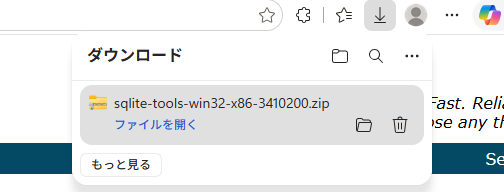
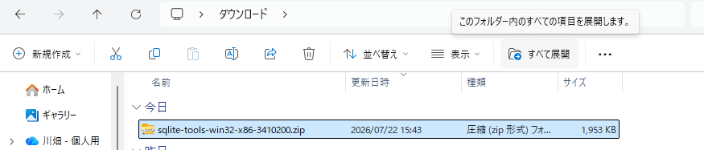
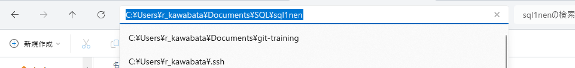
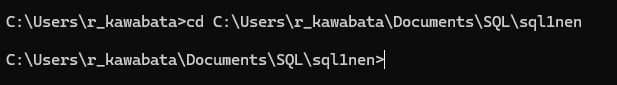
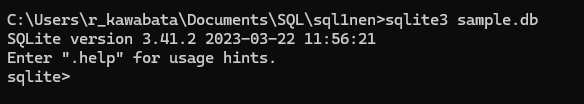
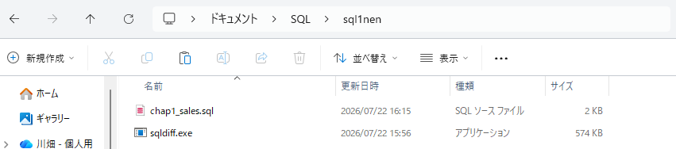
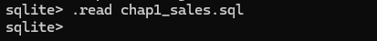
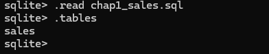
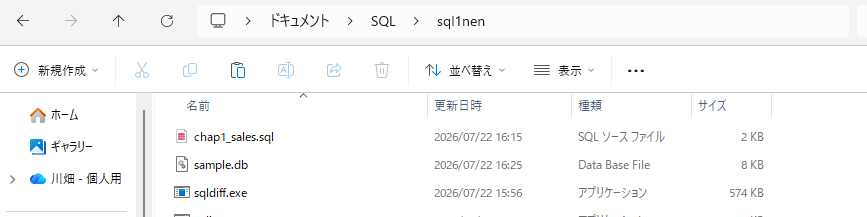
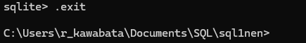

# 第1章「SQLについて学ぼう」

## LESSON01　データベースとSQLって何だろう？

**データベースって何？**

保管されたデータの集まりとそのデータを管理するシステムのこと。

身近なところでは、インターネットのショッピングサイトで商品情報や顧客情報などが、データベースで管理されており、データベースでデータを管理することにより、大量のデータの中から目的のデータを迅速に取り出すことができる。

**DBMSの種類**

コンピュータ上でデータの管理を行うソフトウェアのことをデータベース管理システム（DataBase Management System）といい、DBMSと呼ばれる。

DBMSの種類：階層型データベース・ネットワーク型データベース・リレーショナルデータベース（最もシェア率が高い）

**RDBMSとSQL**

リレーショナルデータベースの管理を行うDBMSは、RDBMSと呼ばれる。

RはRelational（リレーショナル）の略で、「関係のある」という意味がある。RDBMSは、ビジネス向けの大規模なシステムに使うものから、小規模なシステムに使うものなど、さまざまな種類がある。

一般的には「保管されたデータの集まりとそのデータを管理するシステム（DBMS）」をまとめてデータベースと呼ぶが、DBMSで管理するデータの集まりだけを指してデータベースと呼ぶ場合もある。

【代表的なRDBMS】
| 名前 | 説明 |
|-----------|---------------------|
| Oracle Database（オラクルデータベース） | 商用でのシェアが高く、大規模なシステムで利用される |
| MySQL（マイエスキューエル） | オープンソースで、Webアプリケーションの開発に利用される |
| PostgreSQL（ポストグレスキューエル） | 拡張性があり独自の処理を追加できることから、複雑なデータ構成のシステムに利用される |
| SQLite（エスキューライト） | 小規模で高速に動作することから、小規模なシステムやIoT機器（電子機器）などに利用される |

リレーショナルデータベースでは、データをテーブルと呼ばれる2次元の表形式で表す。テーブルの列にあたる部分をカラム、行にあたる部分をレコードといい、また1レコードが1件分のデータに該当し、レコード内の個々のデータが入る場所はフィールドと呼ばれる。

また、リレーショナルデータベースではテーブル同士を関連付けてデータを管理することが可能で、複数のテーブルをデータベースで管理できる。つまり、テーブル同士が関係性を持った（リレーショナルな）状態で管理される。

本書の学習テーマであるSQLは、RDBMSでデータを操作するためのデータベース言語。SQLで書いたSQL文と呼ばれる命令を使うことで、データベースにデータを入れたり、データを取り出したりできる。

SQLはANSI（米国規格協会）やISO（国際標準化機構）などといった団体によって定められた標準規格があり、標準規格に準拠したSQLは標準規格SQLと呼ばれる。

※SQLのQは「問い合わせ」という意味がありQuery（クエリ）に由来していて、SQL文はクエリとも呼ばれている。

**SQLiteの特徴**

メリット
- 軽量なため、動作が高速
- 複雑な設定が不要
- 導入が容易

デメリット
- 複数人で同時に操作できない
- パスワード機能がないため、セキュリティ面に不安がある
- 何十万件もデータがある大規模なデータベースには不向き

**RDBMSとSQLの一般的な使い方**

ショッピングサイトのようなWebアプリケーションの場合、RDBMSはサーバサイドと呼ばれる領域で利用する。サーバサイドに対して、利用者が直接操作するコンピュータ及びWebブラウザはクライアントサイドと呼ばれ、通常、RDBMSは何らかのアプリケーションを通して実行する。

例えば、ショッピングサイトで商品の検索や購入をする際、バックエンドにあるWebアプリケーションからRDBMSにSQL文を渡し、結果を取得する。

## LESSON02　SQLiteを使う環境を準備しよう

まず、EdgeなどのWebブラウザで公式サイトにアクセスする。

＜SQLite公式サイトのダウンロードページ＞

https://www.sqlite.org/download.html

①実行ファイルをダウンロードする
SQLiteの公式サイトから、SQLiteコマンドラインツールが含まれたzipファイルをダウンロードする。

（新しいバージョンがリリースされており、サイトに指定しているバージョンがなかったため、リンクをコピーし、EdgeにペーストしEnterで、ダウンロードが開始される。）

②ダウンロード先のフォルダを表示する

③zipファイルを全て展開する

ダウンロードしたファイルをクリックして、［すべて展開］をクリックする。

展開先のフォルダ指定が求められるため、変更せずに［展開］をクリックする。

④作業用フォルダに展開されたツールをコピーする

ドキュメントフォルダに「sql1nen」という名前のフォルダを作る。そのフォルダ内に、展開されたフォルダに入っていたファイルをコピーして貼り付ける。

これでSQLiteの準備は完了

## LESSON03 SQLiteを起動しよう

**コマンドプロンプトを起動する**

**作業対象のフォルダを変更する**

コマンドプロンプト（もしくはターミナル）で、作業対象となっているフォルダのことをカレントディレクトリという。

    書式：コマンドプロンプトのカレントディレクトリを変更する
      cd フォルダのパス

「cd」は「change directory（チェンジ ディレクトリ）」の略で、カレントディレクトリを変更するための命令。

①Windowsでフォルダのパスを取得する

カレントディレクトリにしたい「sql1nen」フォルダをエクスプローラーで表示する。

エクスプローラーのアドレスバーをクリックし、コピーする。

②cdコマンドで作業用のフォルダを開く
cdのあとに半角スペースを入れ、取得したパスを貼り付けEnterで、指定した「sql1nen」フォルダが開かれた状態になる。

**SQLiteを起動する**

    書式：SQLiteを起動する
      sqlite3 開きたいデータベース名

開きたいデータベースのファイルが存在しない場合は、新しいファイルとして作成する。ここでは「sample.db」という名前のデータベースのファイルを作成する。

    【入力コマンド】SQLiteを起動する
      sqlite3 sample.db

プロンプトの左側が「sqlite」に変わったのは、SQLiteが起動した証拠であり、SQLiteが起動しただけで「sample.db」は作成されておらず、テーブルの作成や何らかの操作を行うとファイルが保存される。

## データベースにテーブルを作ろう

データベースでデータを管理するためには、テーブルを作って、テーブルにデータを入れる必要がある。テーブルを作ったり、データを入れたりするには、SQLで書いた命令であるSQL文を使う。

**データベースにデータを入れる**

P.10に掲載されているサンプルファイルのダウンロードURLの中から「chap1_sales.sql」を作業用の「sql1nen」フォルダにコピーする。

テキストファイルの読み込みには.readコマンドを使い、コマンドの後は半角スペースをあけて、ファイル名を書く。ファイルを読み込むと、記述されたSQL文やコマンドが実行される。

    書式：ファイルを読み込む
      .read ファイル名

    【入力コマンド】ファイルを読み込み、記述されたSQL文を実行する
      .read chap1_sales.sql

テーブルとデータの作成に成功した場合は、何も表示されず次のプロンプトが表示される。

    【入力コマンド】テーブルの一覧を表示
      .tables

「.tables」でデータベースに作られたテーブルの一覧を表示でき、ちゃんとsalesテーブルが作られた。テーブルを作ったことで、「sql1nen」フォルダに「sample.db」が作成された。

データの確認はSELECT文というSQL文を実行する。

**SQLiteを終了する**

コマンドプロンプトやターミナルを終了するとSQLiteも終了するが、SQL文の実行中に終了させるとデータベースのファイルが破損する恐れがあるため、安全にSQLiteを終了するためには、.exitコマンドを使って終了させる。

    【入力コマンド】SQLiteを終了する
      .exit

SQLiteが終了すると、プロンプトの左側が「sqlite」からカレントディレクトリに表示が変わる。

他のRDBMSだと起動や終了をするのに時間がかかる場合があるが、SQLiteは手軽な操作がウリの1つ。

>**SQL文とコマンドの違い**
>
>「.（ドット）」ではじまる命令は、SQLite独自の設定に関する操作を行うもので、SQL文ではない。
>
>また、Oracle DatabaseやMySQLなど、別のRDBMSでは使用できず、逆に、Oracle DatabaseやMySQLなどにも独自のコマンドがある。別のRDBMSを使うときは、使用するRDBMSのコマンドを確認する必要がある。
