# 第2章「データを取り出してみよう」

## LESSON05 作ったデータベースの内容を確認しよう

salesと名前を付けたテーブルにデータを入れる。

RDBMSの種類によっては日本語の名前も付けられるが、どんなRDBMSでも使えるSQL文を作れるように英語の名前を付けたほうがよい。

データベースではカラムに付ける名前はカラム名といい、それぞれ「date」が日付、「item_name」が商品の名前、「item_count」が商品の個数、「price」が代金、「customer」が顧客という意味で、入れるデータが分かりやすい名前を付ける。

## LESSON06 SELECT文を使ってみよう

データベースで一番多い操作がデータの取り出し。

例えば、ショッピングサイトで商品の一覧を表示したり、商品の詳細情報を表示したりするときには、データベースから取り出したデータを表示している。

**SELECT文でデータを取り出してみる**

データベースからデータを取り出すには、SELECT文を使う。

    書式：SELECT文
      SELECT * FROM テーブル名;

「*（アスタリスク）」は指定するテーブルからすべてのカラムを取り出すことを指定し、「FROM」のあとに操作するテーブル名を書く。また、SQL文の終わりには「;（セミコロン）」を付ける決まりがあり、付け忘れるとエラーになるため気を付けなければならない。

    【入力コマンド】SQLiteを起動する
      sqlite3 sample.db

SQLiteが起動したら、次のSQL文を入力し、実行するとsalesテーブルからデータを取り出せる。

    chap2-1.sql
      SELECT * FROM sales;

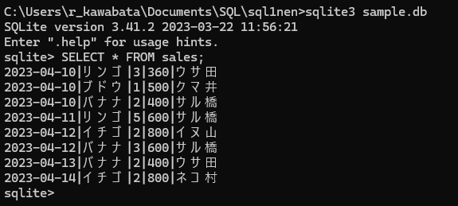

**出力結果の表示形式を変更する**

データの取り出し結果を見やすくするために、ヘッダーを表示してカラム名を表示するようにする。また、表示モードというものを指定することで、表示結果を整列させることもできる。

    書式：ヘッダーを表示する
      .header on

    書式：表示モードをカラムにする
      .mode column

結果の表示形式を変更するコマンドを実行したあと、もう一度SELECT文（SELECT * FROM sales;）を実行してみる。

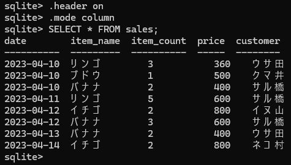

columnモードで取り出したデータを表示するとき、全角のひらがなや漢字が混ざっていると、表示が少しズレてしまう問題がある。

「.exit」でSQLiteを終了させて次に起動したときは、初めの見にくい表で出力されるため、改めて「.header on」「.mode column」を実行する。

**指定したカラムのデータを取り出す**

「SELECT」のあとに「*」を入れた場合は、対象のテーブルから全てのカラムのデータを取り出す。特定のカラムのデータだけを取り出したい場合は、「SELECT」のあとにカラム名を入れる。

    書式：テーブルから指定したカラムのデータを取り出す
      SELECT カラム名 FROM テーブル名;

データベースのフィールドに入る個々のデータは値と表現する。salesテーブルから、customerカラムの値を取り出してみる。

    chap2-3.sql
      SELECT customer FROM sales;

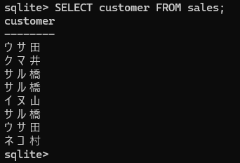

salesテーブルのcustomerカラムだけを取り出している。

**重複した値を取り除く**

SELECT文でカラム名の前にDISTINCT（ディスティンクト）キーワードを入れると重複した値を取り除ける。

    書式：テーブルから重複した値を取り除く
      SELECT DISTINCT カラム名 FROM テーブル名;

    chap2-4.sql
      SELECT DISTINCT customer FROM sales;

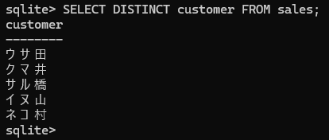

同じ名前が表示されなくなってスッキリする。

**指定した複数カラムのデータを取り出す**

SELECTのあとに指定するカラム名は、「,（カンマ）」で区切ることで複数指定でき、指定した順番にデータを取り出せる。

    書式：テーブルから複数指定したカラムのデータを取り出す
      SELECT カラム名1, カラム名2, ... FROM テーブル名;

salesテーブルから、dateカラム、item_nameカラム、item_countカラムのデータを取り出してみる。

    chap2-5.sql
      SELECT date, item_name, item_count FROM sales;

カラム数が多いテーブルで全カラムのデータを取り出すと、目的のデータを探すのが大変になるため、取り出したいデータが決まっている場合は、カラム名は指定したほうが結果が見やすくなる。

**文と句**

「句」には「文中の言葉のひと区切り」という意味があって、SQL文は複数の「句」をつなげて1つの「文」を表現している。

「SELECT date, item_name, item_count」がSELECT句、「FROM sales;」がFROM句、合わせて「SELECT date, item_name, item_count FROM sales;」がSELECT文になる。

「句」自体が個々の命令になっていて、「salesテーブルから」「date、item_name、item_countのデータを取り出せ（選べ）」という意味になる。

>**SQL文は途中で改行できる**
>
>SQL文は「;」が入力されるまで、Enterキーを押しても改行されるだけで実行はされない。そのため、SQL文の途中で改行を入れることも可能。
>
>ただし、SELECT文やFROMなどのキーワード、カラム名などを途中で改行した状態で実行するとエラーになる。
>
>実行してもエラーにならない：
>
>sqlite> SELECT date, item_name, item_count

>     ...> FROM sales;
>
>実行するとエラーになる：
>
>sqlite> SELECT date, item_name, item_
>
>     ...> count FROM sales;

## LESSON07 取り出した結果をわかりやすくしよう

実行結果のヘッダー部分に表示されるカラム名などの情報は、ASキーワードを使うことで一時的に別の名前を付けられる。SELECT文で別名を付けたいカラム名の後に「AS」と別名を書く。

    書式：見出しに別名を付ける
      SELECT カラム名 AS 別名 FROM テーブル名;

item_nameカラムに「商品名」という別名を付けて、SELECT文を実行する。

    chap2-6.sql
      SELECT item_name AS 商品名 FROM sales;

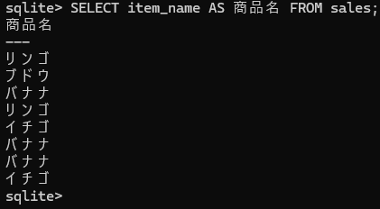

ASキーワードで付けた別名は、エイリアス（alias）とも呼ばれていて、「エイリアスを付ける」と表現することもある。

    chap2-7.sql
      SELECT item_name AS 商品名, item_count AS 個数 FROM sales;

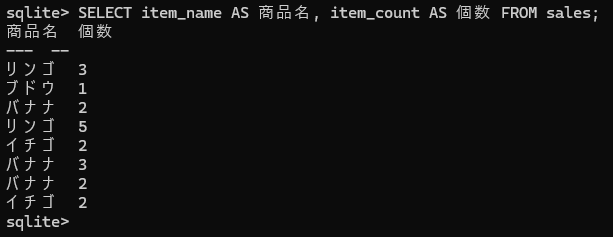

「,」を入れることで、複数のカラムにエイリアスを付けられる。

>**別名に記号を使う場合**
>
>記号を使用したエイリアスを付けたい場合は、エイリアスを「"（ダブルクォーテーション）」で囲む。例えば、次のように「<」「>」を使ったエイリアスは、「"」で囲まないとエラーになりSQLの実行に失敗する。
>
>     chap2-8.sql
>        SELECT item_name AS "<商品名>" FROM sales;
>
> 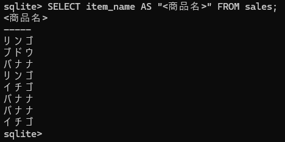

## LESSON08 条件を付けてデータを取り出そう

**WHERE句を使ってみる**

取り出すデータに条件を指定する場合は、FROM句のあとに続けてWHERE句で条件を指定する。

    書式：条件を指定してデータを取り出す
      SELECT * FROM テーブル名 WHERE 条件式;

次のSELECT文は、salesテーブルからitem_nameカラムに入っている値が「リンゴ」のデータを取り出す。条件式に使う値が文字列の場合は、「'（シングルクォーテーション）」で囲む。

    chap2-9.sql
      SELECT * FROM sales WHERE item_name = 'リンゴ';

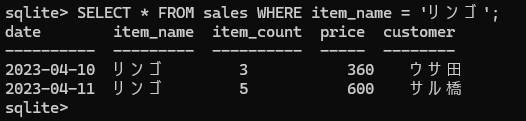

「item_name = 'リンゴ'」で「item_nameカラムの値がリンゴと同じ」という条件を表しており、これによりsalesテーブルから該当するデータを取り出す。

「SELECT * FROM sales WHERE item_name = 'リンゴ';」では、「WHERE item_name = 'リンゴ';」がWHERE句になり、「item_name = 'リンゴ';」が条件式になる。

※データ量が多いデータベースの場合、条件を付けてデータを取り出すのが一般的。

**さまざまな比較演算子を使ってみる**

「item_name = 'リンゴ'」で使っている「＝（イコール）」は比較演算子と呼ばれる記号。比較演算子は演算子の左右にある値を比較する動きがある。

比較演算子
| 記号 | 意味 |
|--------|---------------|
| = | 右辺と左辺が同じ |
| < | 左辺が右辺より小さい |
| > | 左辺が右辺より大きい |
| <= | 左辺が右辺以下 |
| >= | 左辺が右辺以上 |
| <> | 左辺と右辺が違う |

    chap2-10.sql
      SELECT * FROM sales WHERE item_count > 2;

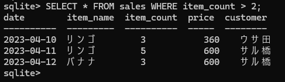

「item_count > 2」の「>」は左辺が右辺より大きいという意味だから、item_countカラムの値が2の場合は含まれない。

    item_countカラムの値が2より大きい（2は含まれない）
      item_count > 2

    item_countカラムの値が2より小さい（2は含まれない）
      item_count < 2

    item_countカラムの値は2以上（2が含まれる）
      item_count >= 2

    item_countカラムの値は2以下（2が含まれる）
      item_count <= 2

「<>」を使って「item_nameカラムの値がリンゴと違う」という条件式に変える。

    chap2-11.sql
      SELECT * FROM sales WHERE item_name <> 'リンゴ';

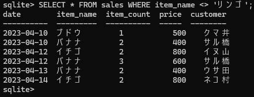

item_nameカラムの値が「リンゴ以外のデータ」が取り出された。

**日付データを条件式に使ってみる**

日付が決められた形式でテーブルに入っている場合、比較演算子で指定した期間のデータを取り出すことができる。そのため、salesテーブルのdateカラムの値は、4桁の西暦、2桁のつき、2桁の日を「-（ハイフン）」で区切った形式で表現している。

また、この形式は、yがyear（年）、mがmonth（月）、dがday（日）で、「yyyy-mm-dd」と表すことができる。

2023年4月11日以降のデータを取り出す場合

    chap2-12.sql
      SELECT * FROM sales WHERE date >= '2023-04-11';

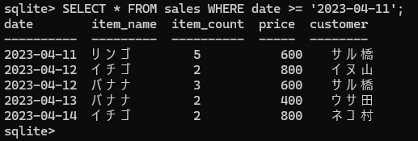

「date >= '2023-04-11'」はdateカラムの値が'2023-04-11'以上という意味。

2023年4月11日よりあとのデータを取り出す場合

    SELECT * FROM sales WHERE date > '2023-04-11';

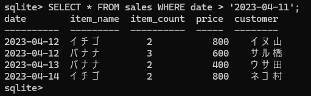

「date > '2023-04-11'」はdateカラムの値が'2023-04-11'より大きいという意味。

## LESSON09 複数の条件を組み合わせてみよう

論理演算子を使うことで、複数の条件を組み合わせた条件式を作ることができる。

**AND演算子を使ってみる**

ANDは「かつ」という意味があり、ANDの左右にある条件式をどちらも満たすデータを取り出せる。

    書式：ANDを演算子を使った条件式
      WHERE 条件式1 AND 条件式2

    chap2-14.sql
     SELECT * FROM sales
     WHERE customer = 'サル橋' AND item_name = 'バナナ';

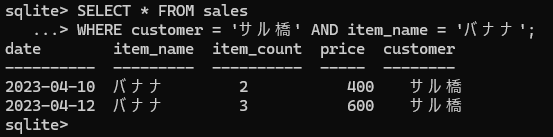

「customer = 'サル橋'」でcustomerカラムの値が'サル橋'と同じ、「AND」でかつ、「item_name = 'バナナ'」でitem_nameカラムの値が'バナナ'と同じという意味になり、サル橋さんがバナナを買った情報だけを取り出している。

**OR演算子を使ってみる**

ORは「もしくは」という意味があり、OR演算子の左右にある条件式のどちらかを満たすデータを取り出せる。

    書式：OR演算子を使った条件式
      WHERE 条件式1 OR 条件式2

    chap2-15.sql
      SELECT * FROM sales
      WHERE item_name = 'リンゴ' OR item_name = 'ブドウ';

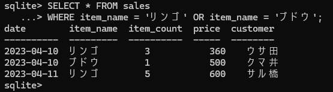

「item_name = 'リンゴ'」でitem_nameカラムの値が'リンゴ'と同じ、「OR」でもしくは、「item_name = 'ブドウ'」でitem_nameカラムの値が'ブドウ'と同じという意味になり、item_nameカラムの値が「リンゴ」もしくは「ブドウ」のデータを取り出している。

**NOT演算子を使ってみる**

NOT演算子は、AND演算子やOR演算子とは少し異なる使い方をする使い方をする演算子。NOTは「ではない」という意味があり、NOT演算子の右辺にある条件式を満たさないデータを取り出せる。

    書式：NOT演算子を使った条件式
      WHERE NOT 条件式

    chap2-16.sql
      SELECT * FROM sales WHERE NOT item_name = 'リンゴ';

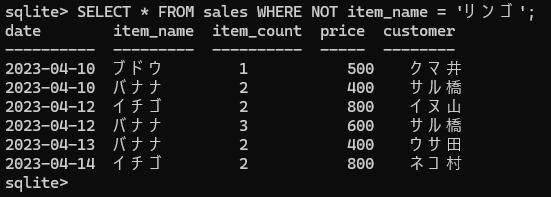

「NOT item_name = 'リンゴ'」でitem_nameカラムの値が'リンゴ'と同じ、「NOT」でではないという意味になり、item_nameカラムの値が'リンゴ'と同じではないデータを取り出している。

**複数の演算子を組み合わせてみる**

複数の演算子を組み合わせて複雑な条件を作ることもできる。ただし、複数の演算子を使うときは、演算子の優先順位に注意する必要がある。

通常、条件式は左から右に向かって処理を実行するが、優先順位が異なる演算子が使用されている場合、優先順位の高い演算子から実行される。

OR演算子とAND演算子を組み合わせた条件

    chap2-17.sql
      SELECT * FROM sales
      WHERE customer = 'サル橋' OR customer = 'ウサ田'
      AND item_name = 'リンゴ';

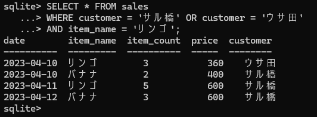

「customer = 'ウサ田' AND item_name = 'リンゴ'」がcustomerカラムの値が'ウサ田'と同じ、かつ、item_nameカラムの値が'リンゴ'と同じという意味、「customer = 'サル橋'」でcustomerカラムの値が'サル橋'と同じ、「OR」でもしくはという意味になり、OR演算子よりAND演算子のほうが優先順位が高いから、AND演算子から先に処理を行っている。

**カッコを使って演算子の優先順位を変えてみる**

優先順位が低い演算子から処理を行いたい場合は、その部分をカッコで囲むことで順番を変えられる。

    chap2-18.sql
      SELECT * FROM sales
      WHERE (customer = 'サル橋' OR customer = 'ウサ田')
      AND item_name = 'リンゴ';

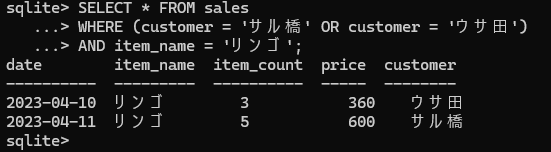

カッコで囲んだだけで結果が変わる。

「customer = 'サル橋' OR customer = 'ウサ田'」をカッコで囲んだから、AND演算子よりOR演算子の判定が先に行われた。

customerカラムの値が'サル橋'と同じ、もしくは、customerカラムの値が'ウサ田'と同じ、かつ、item_nameカラムの値が'リンゴ'と同じデータを取り出している。

>**「=」と「==」**
>
>比較演算子の「=」は、右辺と左辺が同じかを判定（比較）する働きがある。SQLiteの場合、「==」も「=」と同じ働きを持つ。しかし、「==」が使えるのはSQLiteのみで、MySQLなど他のRDBMSでは使用できない。他のRDBMSでも使えるSQLの書き方を身につけるためにも、「==」ではなく「=」を使うようにする。
>
>     「==」の使用例
>
>       SELECT * FROM sales WHERE item_name == 'リンゴ';

## LESSON10 さまざまな条件式を作ってみよう

**IN演算子を使ってみる**

複数のデータのうちいずれかに一致するものを取り出したいときは、IN演算子を使うと便利。WHERE句でカラム名のあとにINと続けてカッコ内に、探したいデータを「,」で区切って並べる。また、カッコ内に入れたデータはリストと呼ばれる。

    書式：リストのいずれかの値と一致する条件式
      WHERE カラム名　IN (データ1, データ2, ...)

IN演算子を使って、item_nameカラムの値がリンゴ、もしくはイチゴと同じデータを取り出す。

    chap2-19.sql
      SELECT * FROM sales WHERE item_name IN('リンゴ', 'イチゴ');

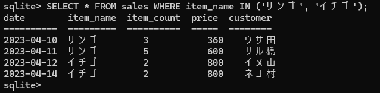

「item_name IN ('リンゴ','イチゴ')」でitem_nameカラムの値がリスト内のデータと同じという意味、つまり、item_nameカラムの値がリンゴ、もしくはイチゴと同じデータを取り出している。

    「=」と「OR」を使って書き換えた場合
      SELECT * FROM sales
      WHERE item_name = 'リンゴ' OR item_name = 'イチゴ';

**NOT IN演算子を使ってみる**

IN演算子とは逆に、複数の値のうちいずれにも一致しないデータを取り出したいときは、NOT IN演算子を使う。書き方はIN演算子と同じ。

    書式：リストのいずれの値にも一致しない条件式
      WHERE カラム名 NOT IN(データ1, データ2, ...);

    chap2-20.sql
      SELECT * FROM sales WHERE item_name NOT IN('リンゴ', 'イチゴ');

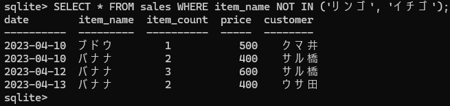

「item_name NOT IN ('リンゴ','イチゴ')」でitem_nameカラムの値がリストにないという意味、つまり、item_nameカラムの値がリンゴ、もしくはイチゴと同じではないデータと取り出している。

    <>演算子とAND演算子を組み合わせたSQL文の場合
      SELECT * FROM sales
      WHERE item_name <> 'リンゴ' AND item_name <> 'イチゴ';

**BETWEEN演算子を使ってみる**

数や日付で特定の範囲を指定したい場合は、BETWEEN演算子を使って条件式を作る方法がある。

    書式：指定した値の範囲の条件式
      WHERE カラム名 BETWEEN 値1 AND 値2;

WHERE句でカラム名のあとにBETWEENを入れ、続けて指定したい範囲の値をAND演算子でつなぐ。通常、AND演算子は「かつ」という意味だが、BETWEEN演算子と組み合わせて使う場合、「から」という意味に変わる。

    chap2-21.sql
      SELECT * FROM sales
      WHERE date BETWEEN '2023-04-11' AND '2023-04-13';

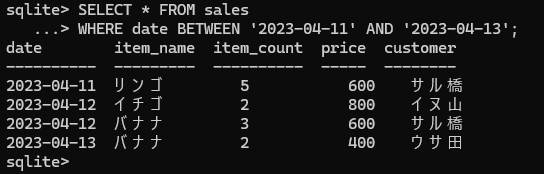

「date BETWEEN '2023-04-11' AND '2023-04-13'」の「BETWEEN」が「の間」、「AND」が「から」になり、dateカラムの値が'2023-04-11'から'2023-04-13'の間という意味になる。

    BETWEEN演算子を使わない場合
      SELECT * FROM sales
      WHERE date >= '2023-04-11' AND date <= '2023-04-13';

dateカラムの値が「2023-04-11」以上かつ「2023-04-13」以下という意味。

**NOT BETWEEN演算子を使ってみる**

BETWEEN演算子とは逆に、指定した範囲外のデータを取り出したいときはNOT BETWEEN演算子を使う。書き方はBETWEEN演算子と同じ。

    書式：指定した値の範囲外の条件式
      WHERE カラム名 NOT BETWEEN 値1 AND 値2;

    chap2-22.sql
      SELECT * FROM sales
      WHERE date NOT BETWEEN '2023-04-11' AND '2023-04-13';

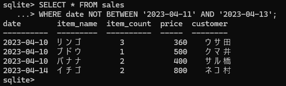

NOT BETWEEN演算子の働きで、「～から～の間以外」という条件になった。

「date NOT BETWEEN '2023-04-11' AND '2023-04-13'」の「NOT BETWEEN」が「の間以外」、「AND」が「から」になり、dateカラムの値が'2023-04-11'から'2023-04-13'の間以外という意味になる。

    NOT BETWEEN演算子を使わない場合
      SELECT * FROM sales
      WHERE date < '2023-04-11' OR date > '2023-04-13';

「2023-04-11」より小さい、もしくは「2023-04-13」より大きいという意味。