# 第3章「取り出したデータを加工してみよう」

## LESSON11 データを集計しよう

**集計関数**

DBMSにはデータベース内のデータを集計したり、操作したりするための関数というしくみが用意されている。関数にデータや条件などを渡すと、何らかの処理を行って結果を返す。また関数に渡すデータや条件のことを引数、関数から得られる結果を戻り値という。

関数にはいくつか種類があり、対象テーブルにあるカラムの合計値や平均値など、数値から何らかの結果を返す関数を集計関数という。

集計関数
| 関数 | 意味 |
|---------|----------------|
| COUNT（カウント） | テーブルのレコード数を求める |
| SUM（サム） | 指定したカラムの合計値を求める |
| AVG（エイブイジー） | 指定したカラムの平均値を求める |
| MIN（ミン） | 指定したカラムの最小値を求める |
| MAX（マックス） | 指定したカラムの最大値を求める |

関数もRDBMSによっては独自のものがあったり、同じ関数名でも引数の数が違ったりする。ここで紹介する集計関数はどのRDBMSでも使える。

**レコード数を数えてみる**

集計関数を使ったSQL文の基本的な書式は、関数名のあとに続けて引数を（）で囲む。

    書式：関数を使うときの基本的なSQL文
      SELECT 関数名(引数) FROM テーブル名;

COUNT関数ですべてレコード数を求める場合は、引数に「*」を指定する。

    chap3-1.sql
      SELECT COUNT(*) FROM sales;

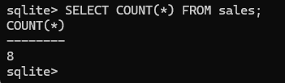

SELECT句で関数を使うと、見出しには関数名と引数が表示され、ASキーワードを使うと別の名前を付けられる。

    chap3-2.sql
      SELECT COUNT(*) AS records FROM sales;

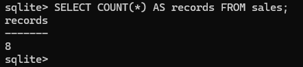

>**COUNT関数の引数にカラム名を指定した場合**
>
>COUNT関数の引数にカラム名を指定することも可能。カラム名を指定した場合、値がNULL値ではないレコードが対象になる。NULL値はセルにデータが入っていないことを表す。

**指定したカラムの合計値を求める**

次のSQL文を実行すると、salesテーブルのpriceカラムの値をすべて合計した値が求められる。

    chap3-3.sql
      SELECT SUM(price) FROM sales;

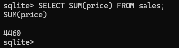

「360+500+400+600+800+600+400+800=4460」の計算が行われた。

**指定したカラムの平均値を求める**

AVG関数はAverageを略して付けられた名前で、Averageには「平均値」という意味がある。

    chap3-4.sql
      SELECT AVG(price) FROM sales;

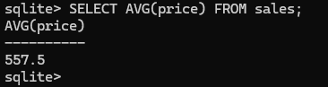

「360+500+400+600+800+600+400+800=4460÷8=557.5」の計算が行われ、ここでは1日あたりの平均売上ということになる。季節や天気によって、売上がどう変わるのかを調べるのによい。

**指定したカラムの最小値と最大値を求める**

今度はMIN関数とMAX関数を同時に使ってみる。関数も「,」で区切ることで同時に使うことができる。

MINは「最小」という意味があるMinimum（ミニマム）の略で、MAXは「最大」という意味があるMaximum（マキシマム）の略。

    chap3-5.sql
      SELECT MIN(price), MAX(price) FROM sales;

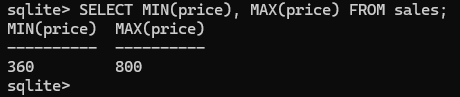

数値以外にも、文字列で表した日付もMIN関数とMAX関数を使える。

    chap3-6.sql
      SELECT MIN(date), MAX(date) FROM sales;

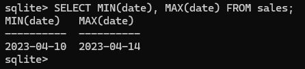

日付が一番古い値が最小値で、一番新しい日付が最大値になる。

文字列で表した日付から最大値と最小値を探す場合、形式がそろっていないと正しい結果が得られないから注意しなければならない。

## LESSON12 データをグループ化しよう

**GROUP BY句でデータをグループにまとめる**

データをグループ化するにはGROUP BY 句を使う。GROUP BYは「グループ分けする」という意味がある。

    書式：GROUP BY 句の基本的な使い方
      SELECT カラム名, 関数(引数) FROM テーブル名 GROUP BY カラム名;

GROUP BY 句は関数と組み合わせて使うため、SELECT句で関数を使う。そして、テーブル名のあとにGROUP BY 句でグループ化したいカラムを指定する。

GROUP BY 句とCOUNT関数を組み合わせて、お客さんごとの来店回数を求めてみる。

    chap3-7.sql
      SELECT customer, COUNT(*) FROM sales GROUP BY customer;

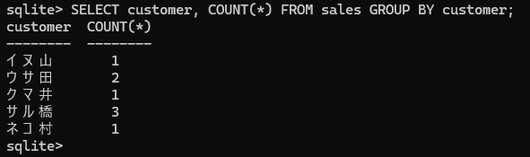

salesテーブルをcustomerカラムの値ごとにグループを作り、そのうえでグループごとにCOUNT関数の処理を行っているため、お客さんごとの来店回数が分かる。

GROUP BY 句を使うときは、SELECT句で指定しているカラム名にする必要がある。

実際にGROUP BY句とSELECT句で異なるカラム名を指定した例

    chap3-8.sql
      SELECT item_name, COUNT(*) FROM sales GROUP BY customer;

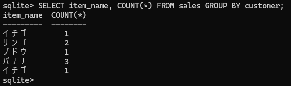

customerカラムでグループ化をしているのに、SELECT句でitem_nameカラムを指定しているから、正しい結果が得られなくなってしまった。

GROUP BY 句でグループ化するカラムは、SELECT句で指定するカラムにする、というルールを覚えておけばよい。

**GROUP BY句とSUM関数を組み合わせてみる**

    chap3-9.sql
      SELECT item_name, SUM(price) FROM sales GROUP BY item_name;

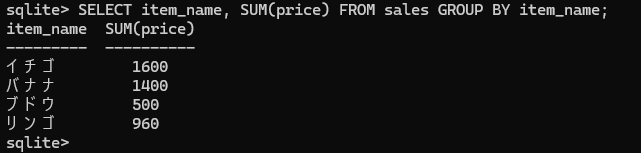

item_nameカラム、つまり商品ごとのグループを作って、グループごとにSUM関数でpriceカラムの値を合計させている。

**GROUP BY句とAVG関数を組み合わせてみる**

次は日付でグループ化し、AVG関数で1日の平均売上額を求めているSQL文

    chap3-10.sql
      SELECT date, AVG(price) FROM sales GROUP BY date;

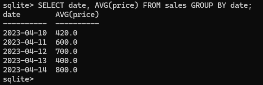

## LESSON13 グループ化した値を結合させよう

GROUP_CONCATという関数で、指定したカラムの値を結合する働きがある。結合は、複数の値をつなげて、1つの値にすること。

**GROUP_CONCAT関数を使ってみる**

GROUP_CONCAT関数もCOUNT関数やSUM関数などの集計関数と使い方は同じで、引数に値を結合させたいカラム名を入れる。

    chap3-11.sql
      SELECT customer, GROUP_CONCAT(item_name) FROM sales
      GROUP BY customer;

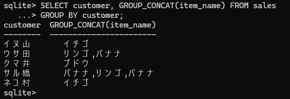

customerカラムでグループ化して、グループごとにitem_nameカラムの値を連結しており、お客さんごとにどの商品を買ったかという情報になっている。

GROUP_CONCAT関数でカラムの値を連結すると、連結した値の間には「,」が入る。値を区切る文字は「区切り文字」と呼ぶ。

**GROUP_CONCAT関数とDISTINCTキーワードを組み合わせる**

DISTINCTキーワードを使うことで、指定したカラムのデータが重複しなくなる。関数の引数にカラム名を指定する際、DISTINCTキーワードを付けることにより、データが重複しない結果が得られる。

    書式：関数の引数にDISTINCTキーワードを付ける
      GROUP_CONCAT(DISTINCT カラム名)

    chap3-12.sql
      SELECT customer, GROUP_CONCAT(DISTINCT item_name) FROM sales
      GROUP BY customer;

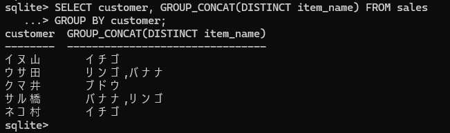

## LESSON14 グループ化した結果に条件を指定しよう

集計した結果に対して条件を付けたい場合は、HAVING句を使う。

**HAVING句を使ってみる**

HAVING句を使うことで、グループ化して集計した結果に対して条件を付けることができる。

    書式：HAVING句の基本的な使い方
      SELECT カラム名, 集計関数 FROM テーブル名
      GROUP BY カラム名 HAVING 条件式;

次のSQL文では、HAVING句の条件式に集計関数の1つであるCOUNT関数を使っている。GROUP BY句でcustomerカラムを指定しているため、customerカラムの値でグループ化し、レコードが2件以上あるデータが取り出される。

    chap3-13.sql
      SELECT customer, COUNT(*) FROM sales
      GROUP BY customer HAVING COUNT(*) >= 2;

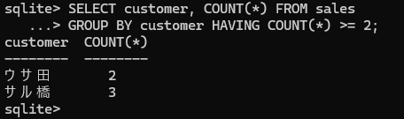

グループ化してもレコード数が何十、何百件とある場合は、HAVING句で条件を付けてデータを絞り込む。

**句の実行順番に注目する**

SQL文の句は実行される順番が決まっている。

「FROM句」データを取り出すテーブルを指定する→「WHERE句」取り出すデータの条件を付ける→「GROUP BY句」グループ化する→「HAVING」グループ化したあとに条件を付ける→「SELECT句」取り出すカラムを指定する

Pythonなどのプログラミング言語は、上から下に向かって実行されるが、SQL文の句は書いた順番に実行されないことがポイント。

    chap3-14.sql
      SELECT customer, COUNT(*) FROM sales
      WHERE customer <> 'ウサ田'
      GROUP BY customer HAVING COUNT(*) >= 2;

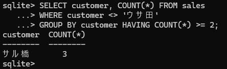

「FROM句」salesテーブルを指定する→「WHERE句」customerカラムの値が「ウサ田」と同じではない→「GROUP BY句」customerカラムでグループ化する→「HAVING句」レコードが2件以上である→「SELECT句」customerカラムとレコードの数を取り出す

WHERE句とHAVING句は、どちらもレコードを絞り込むための条件を指定するが、WHERE句はグループ化する前のデータ、HAVING句はグループ化したあとのデータにそれぞれ条件を付けている。そのため、WHERE句では集計関数を使えない。特定のカラムだけをグループ化したい場合は、WHERE句で条件を指定しておくと読みやすいSQL文になる。

## LESSON15 データを並び替えよう

ORDER BY 句を使うと、取り出したデータを指定したカラムのデータで並べ替えられる。ORDERには「注文」という意味もあるが、ここでは「順番」という別の意味で使われている。

**ORDER BY 句で並べ替える**

ORDER BY 句は、取り出したデータを並べ替える働きがある。ORDER BY 句の最も基本的な書式は次のとおりで、ORDER BY のあとに並べ替えの基準にするカラム名を書く。

    書式：ORDER BY 句の基本的な使い方
      SELECT * FROM テーブル名 ORDER BY 並べ替え基準のカラム名;

次のSQL文は、ORDER BY 句にpriceカラムを指定しているため、取り出したデータが代金が安い順番に並べ替えた状態で出力される。

    chap3-15.sql
      SELECT * FROM sales ORDER BY price;

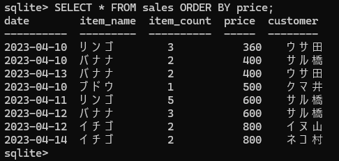

**並べ替え方法を指定する**

ORDER BY 句でDESCキーワードを使うと、大きい方から小さい方へ向かって並べ替えられる。DESCキーワードは、並べ替え基準のカラム名のあとに書く。

    書式：指定した値の範囲
      SELECT * FROM テーブル名 ORDER BY 並べ替えの基準カラム名 DESC;

    chap3-16.sql
      SELECT * FROM sales ORDER BY price DESC;

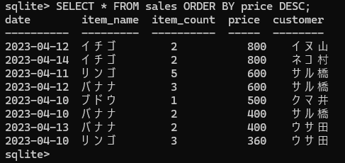

DESCはDescending（ディセンディング）の略で、降順という意味がある。そのため、データを大きい方から小さい方へ向かって並べ替えることを降順という。また、小さい方から大きい方へ向かって並べ替えることは昇順という。ORDER BY 句でDESCキーワードを書かなかった場合、自動的に昇順を指定するASCキーワードが書かれたものとして実行される。ASCはAscending（アセンディング）の略で昇順という意味がある。

「SELECT * FROM sales ORDER BY price;」＝「SELECT * FROM sales ORDER BY price ASC;」

**複数のカラムを指定して並べ替える**

    chap3-17.sql
      SELECT * FROM sales ORDER BY item_count DESC;

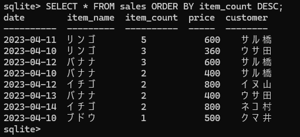

item_countカラムの値が同じ3でも、priceカラムの値は360、600の順番で降順にはなっていない。

複数のカラムのデータを取り出す場合、並べ替え基準のカラムを複数指定することで、より分かりやすい結果が得られる。

    書式：ORDER BY 句で並べ替え基準のカラムを複数指定する
      SELECT * FROM テーブル名
      ORDER BY 並べ替え基準のカラム名1 DESC, 並べ替え基準のカラム名2 DESC;

    chap3-18.sql
      SELECT * FROM sales ORDER BY item_count DESC, price DESC;

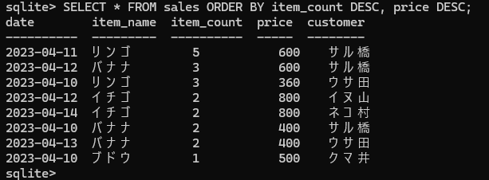

item_countカラムの値が同じ値でも、priceカラムの値でさらに並べ替わる。

## LESSON16 複数の句を組み合わせたSELECT文を作ってみよう

**ORDER BY 句が実行される順番を学ぶ**

「FROM句」データを取り出すテーブルを指定する→「WHERE句」取り出すデータの条件を付ける→「GROUP BY句」グループ化する→「HAVING句」グループ化したあとに条件を付ける→「SELECT句」取り出すカラムを指定する→「ORDER BY句」レコードを並べ替える

並べ替えはデータを取り出したあとに行うため、ORDER BY 句はSELECT句のあとに実行される。

**絞り込んだデータを並べ替える**

まずは、WHERE句とORDER BY 句を組み合わせて、条件で絞り込んだデータを並べ替える。

WHERE句とORDER BY 句を組み合わせるときは、WHERE句の条件式のあとにORDER BY 句を書く。

    書式：WHERE句とORDER BY 句を組み合わせる
      SELECT * FROM テーブル名 WHERE 条件式 ORDER BY カラム名;

次のSQL文は、WHERE句でitem_nameカラムの値が「バナナ」と同じという条件で、priceカラムの値で並べ替えたうえ、データを取り出す。

    chap3-19.sql
      SELECT * FROM sales WHERE item_name = 'バナナ' ORDER BY price;

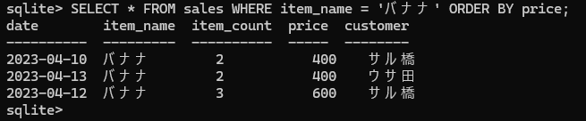

「FROM句」salesテーブルを指定する→「WHERE句」item_nameカラムの値が「バナナ」と同じ→「SELECT句」すべてのカラムの値を取り出す→「ORDER BY句」priceカラムの値で並べ替える

WHERE句のあとにORDER BY 句を書くが、実行の順番はWHERE句で条件を指定したあと、SELECT句でデータを取り出したうえで、並べ替えている。書き順と違って、SELECT句のあとにORDER BY 句が実行されていることに注意。

**グループ化して集計したデータを並べ替える**

グループ化したデータを並べ替える場合は、GROUP BY 句の直後にORDER BY 句を書く。HAVING句を使う場合は、GROUP BY 句→HAVING句→ORDER BY 句の順番になる。

またグループ化して集計を行う場合は、ORDER BY 句にSELECT句と同じ集計関数を指定して、並べ替えることも可能。

    書式：GROUP BY 句とORDER BY 句を組み合わせる
      SELECT カラム名1, 集計関数 FROM テーブル名
      GROUP BY カラム名1 [HAVING 条件式]
      ORDER BY 並べ替え基準のカラム名もしくは集計関数;

    chap3-20.sql
      SELECT item_name, SUM(item_count) FROM sales
      GROUP BY item_name
      ORDER BY SUM(item_count) DESC;

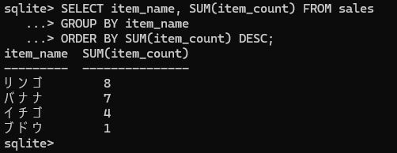

ORDER BY 句はグループ化したあとに実行されるから、集計関数で求めた数値を使ってデータを並べ替えられる。

「FROM句」salesテーブルを指定する→「GROUP BY句」item_nameカラムでグループ化する→「SELECT句」item_nameカラムとitem_countカラムの合計値を取り出す→「ORDER BY句」item_countカラムの合計値で降順に並べ替える（SELECT句とORDER BY句では集計関数を使える）

グループの種類が多いときは、ORDER BY 句を組み合わせて並べ替えるとより分かりやすい結果が得られる。

**ここまでに学んだ句をすべて使ってみる**

    chap3-21.sql
      SELECT item_name, SUM(item_count) FROM sales
      WHERE item_name <> 'バナナ'
      GROUP BY item_name HAVING SUM(item_count) > 2
      ORDER BY SUM(item_count) DESC;

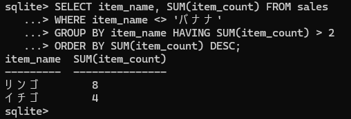

WHERE句の条件式は「item_name <> 'バナナ'」だから、item_nameカラムの値がバナナと同じではないレコード以外がグループ化される。そして、HAVING句の条件式は「SUM(item_count) > 2」だから、グループごとのitem_countカラムの値が2より大きいデータだけが取り出される。

「FROM句」salesテーブルを指定する→「WHERE句」item_nameカラムの値が「バナナ」と同じではない→「GROUP BY句」item_nameカラムでグループ化する→「HAVING句」item_countカラムの合計値が2より大きい→「SELECT句」item_nameカラムとitem_countカラムの合計値を取り出す→「ORDER BY句」item_countカラムの合計値で降順に並べ替える（HAVING句、SELECT句、ORDER BY句では集計関数を使える）

グループ化したあとであれば集計関数を使うことができる。WHERE句とHAVING句はどちらも取り出すデータに条件を付ける役割があるが、グループ化する前に実行するWHERE句では集計関数は使えないから注意しなければならない。

複雑なデータベースになるほど、何行もSQL文を書く必要があり、その場合、句の実行順序を意識しながらSQL文を書かないと思いどおりの結果が得られない。そのため、基本的なSQL文でしっかりと句の書き順と実行順を押さえておく必要がある。短いSQL文でも、思ったとおりの結果が得られないときは、句の実行順序や条件式を見直すとよい。

>**WHERE句で集計関数を使用した場合**
>
>WHERE句で集計関数を使用すると、エラーメッセージが表示される。
>
>     chap3-22.sql
>      SELECT item_name, SUM(item_count) FROM sales
>      WHERE SUM(item_count) > 2
>      GROUP BY item_name;
>
> 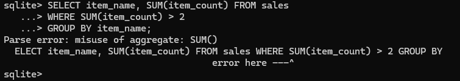
>
>Parse error（パースエラー）は、SQL文の解析に失敗したことを伝えるメッセージ。「misuse of aggregate: SUM()」は直訳すると「集計の誤用：SUM()」という意味で、SUM関数の誤った使い方が原因であることを指している。
