# 第4章「データを変更してみよう」

## LESSON17 CRUDって何だろう？

**DBMSの基本機能**

DBMSが持つ基本機能は、Create（作成）、Read（読み込み/取り出し）、Update（更新）、Delete（削除）の4つ。それぞれの頭文字を取ってCRUD（クラッド）と呼ばれている。

    Create ------ データの作成
    Read -------- データの読み込み（取り出し）
    Update ------ データの更新
    Delete ------ データの削除

RDBMSにはこの4つの機能を使うSQL文が用意されており、データの読み込みを行えるのがSELECT文。また、テーブルを作るためのCREATE文とテーブルにデータを作成するためのINSERT文は、どちらもデータの作成機能を使うためのSQL文。

なお、データの更新はUPDATE文、データの削除はDELETE文を使う。

**データベースをバックアップする**

データの作成や更新などを行う前に、データベースをバックアップしておく。バックアップは、データを別のファイルにコピーして保管しておくこと。

操作を間違えたときや、不慮の事故でデータが消失してしまったとき、バックアップしたファイルを使ってもとの状態に戻すことができる。ちなみに、もとの状態に戻すことはレストア（restore）という。

    書式：データベースのバックアップファイルを作る
      .backup 作成するファイル名

    書式：バックアップファイルを作ったデータベースの復元
      .restore バックアップファイル名

.backupコマンドでバックアップする対象は、操作しているデータベース。「sqlite3 sample.db」でSQLiteを実行した場合、「sample.db」がバックアップの対象になる。次のコマンドで「sample.db」をバックアップしてみる。

    chap4-1.sql
      .backup sample.back

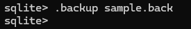

.backupコマンドを実行しても何も表示されない場合は、バックアップファイルの作成に成功している。作業用フォルダの「sql1nen」フォルダを開いて、ファイルがあるかを確認する。

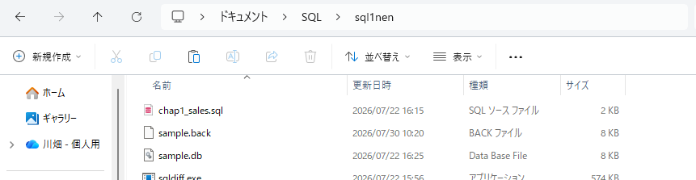

>**直接ファイルをコピーしてバックアップする**
>
>SQLiteはデータベースがファイルとして保存される。そのため、エクスプローラーやファインダーなどの操作で、ファイルを複製しバックアップファイルを作ることも可能。しかしその方法だと、SQLiteを終了させないと復元できない。.backupコマンドでバックアップした場合、SQLiteを起動させたまま復元できるため、コマンドを使ったバックアップがおすすめ。

## LESSON18 データを作成しよう

**INSERT文を使ってみる**

データベースにデータを作成するときはINSERT文を使う。INSERTは「挿入」という意味があり、「データの作成」を「データの挿入」などと表現することもある。

    書式：データの追加①
      INSERT INTO テーブル名 (カラム名1, カラム名2, ...)
      VALUES (値1, 値2, ...);

INSERT INTOのあとにデータを作成したいテーブルを指定する。そのあとカッコの中にカラム名を「,」で区切って入れる。最後にVALUESとそのあとのカッコに入れたい値を「,」で区切って入れる。列挙したカラム名と入れたい値の順番は連動させる必要がある。

.sqlと拡張子が付いたサンプルファイルの中身は、すべてテキストデータである。そのため、Windowsではメモ帳、macOSではテキストエディットを使用することで、中身を確認できる。

Windowsの場合は、①ファイル名を右クリックし、②[プログラムから開く]から③[メモ帳]をクリックする。また、macOSの場合は、ファイル名をcontrolキーを押しながらクリックし、[このアプリケーションで開く]-[テキストエディット.app]をクリックする。

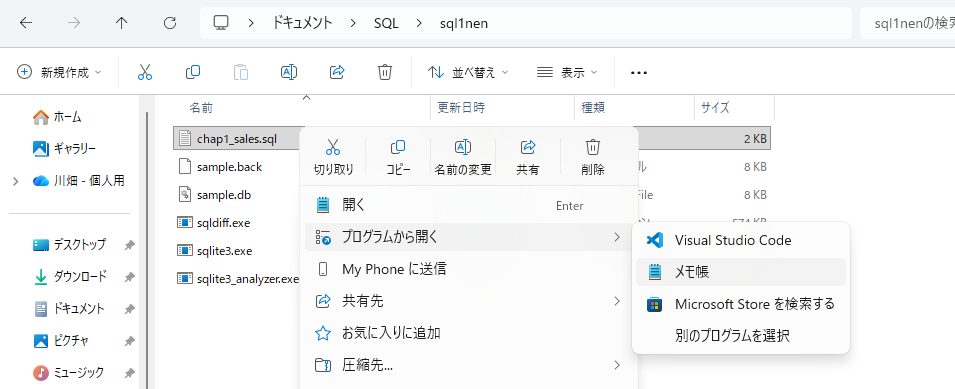

そうすることで、ファイル内のSQL文が表示される。

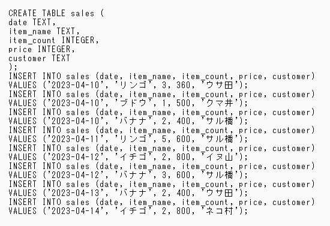

最初の7行はsalesテーブルを作るためのSQL文で、8～23行目がINSERT文。

1件のデータごとにINSERT文を1回実行しており、INSERT文はカラム名と値を列挙すると1つのSQL文が長くなるため、1つのSQL文を改行して2行に分けている。

8、9行目のINSERT文だけに注目すると

    INSERT INTO sales (date, item_name, item_count, price, customer)
    VALUES('2023-04-10', 'リンゴ', 3, 360, 'ウサ田');

1行目のカッコ内の「date, item_name, item_count, price, customer」が値を入れるカラム名で、2行目のカッコ内の「'2023-04-10', 'リンゴ', 3, 360, 'ウサ田'」が各カラムに入れる値である。

カラムの順番と値の順番は対応関係にあって、対応するカラムに値が入る。カラムの順番と値の順番が一致しないと、意図しないカラムに値が入ってしまうから注意が必要。

INSERT文でデータの追加に成功した場合は、何も表示されない。そのため、INSERT文を実行したあとに、続けてSELECT文を実行してテーブルの中身を確認する。

    chap4-2.sql
      INSERT INTO sales (date, item_name, item_count, price, customer)
      VALUES ('2023-04-15', 'イチゴ', 2, 800, 'クマ井');
      SELECT * FROM sales;

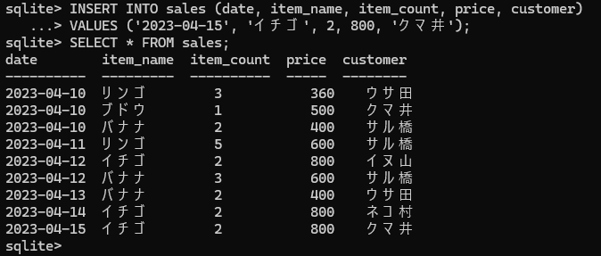

**カラム名を省略する**

INSERT文ですべてのカラムに値を入れる場合、カラム名は省略できる。カラム名を省略する場合、テーブルのカラムの数だけカラムの順番にあわせて値を列挙する。

    書式：データの追加②
      INSERT INTO テーブル名 VALUES (値1, 値2, ...);

    chap4-3.sql
      INSERT INTO sales
      VALUES ('2023-04-15', 'イチゴ', 1, 400, 'ウサ田');
      SELECT * FROM sales;

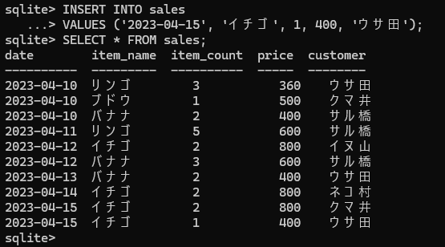

カラム名を指定するINSERT文の場合、誤ってNULL値が入ってしまうことがあるため、特別な理由がない限りはカラム名を省略した書き方がおすすめ。NULL値はセルに値が入っていないことを表している。

**NULL値について学ぶ**

    chap4-4.sql
      INSERT INTO sales (date, item_name, item_count, price)
      VALUES ('2023-04-16', 'ブドウ', 1, 500);
      SELECT * FROM sales;

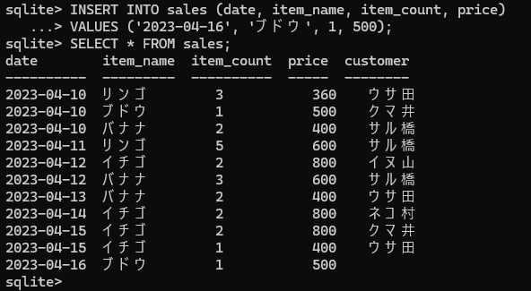

SQL文のカラム名にcustomerがなく、値も1つ足りないため、何も表示されていない。

カラム名を省略したINSERT文の場合、データの入れ漏れ（NULL値）を防ぐことができる。

    chap4-5.sql
      INSERT INTO sales VALUES ('2023-04-16', 'バナナ', 2, 400);

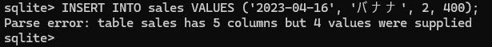

Parseエラーは、SQL文の構文に誤りがあると発生するエラー。メッセージは「salesテーブルには5つのカラムがあるが、指定された値は4つ」という意味だから、入れようとしたデータの数が足りないから、エラーになってデータの作成に失敗したことが分かる。カラム名を省略するときは、カラムの数と値の数が一致していないといけない。あえてNULL値を入れたい場合以外は、カラム名を省略したINSERT文を作る。

>**NULL値があるときのCOUNT関数**
>
>COUNT関数を使うと、レコードの件数を数えられる。引数に「*」を指定した場合はすべてのレコード件数を数えられるが、カラム名を引数にした場合はNULL値以外の値が入ったレコード数を数える。
>
>     chap4-6.sql
>      SELECT COUNT(*), COUNT(customer) FROM sales;
> 
>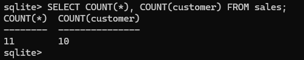

>**NULL値を持つデータの探し方**
>
>指定したカラムにNULL値が入っているかどうかは、IS NULL演算子で調べられる。WHERE句でカラム名のあとにIS NULLを書く。
>
>     chap4-7.sql
>      SELECT date, item_name, item_count, price 
>      FROM sales WHERE customer IS NULL;
>
>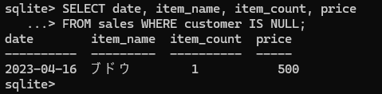

>**コメント機能**
>
>SQLiteはテキストファイルから読み込んだSQL文を実行できる。テキストファイルにSQL文を書いて整理する場合、SQL文の働きが分かるようにしたいもの。そこで利用するのがコメント機能。/*から */の範囲はコメントと呼ばれ、SQL文の一部とは見なされない。SQL文に注釈を付けたい場合に、コメント機能を利用するとよい。
>
>     コメントの例
>
>      /*salesテーブルからデータを取り出す*/
>      SELECT * FROM sales;

**データを復元する**

ここまでの状態をsample2.backとしてバックアップしてから、.restoreコマンドで復元を行う。コマンドを実行したあと、SELECT文で復元されたかも確認する。

    chap4-8.sql
      .backup sample2.back
      .restore sample.back
      SELECT * FROM sales;

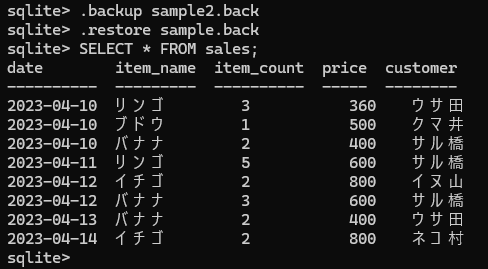

## LESSON19 データを更新しよう

**UPDATE文を使ってみる**

    書式：データを追加
      UPDATE テーブル名 SET カラム名 = 値 WHERE 条件式;

UPDATEのあとにデータを変更したいテーブルを指定する。SETのあとにはデータを更新したいカラム名と入れたい値を「＝」でつなぐ。「＝」は右辺と左辺が同じかどうかを判定する働きがあるが、SETのあとに使う「＝」は左辺のカラムに右辺の値を入れる働きがある。そして最後にWHERE句を付ける。

    chap4-9.sql
      UPDATE sales SET date = '2023-04-15' WHERE date = '2023-04-14';
      SELECT * FROM sales;

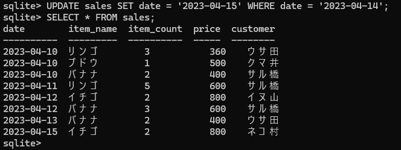

更新するデータの条件はdateカラムが「2023-04-14」のレコード。SET句でdateカラムに「2023-04-15」を指定している。

**複数の値を更新してみる**

SET句を「,」で区切ることで、複数の値を更新することも可能。

    書式：データの更新
      UPDATE テーブル名 SET カラム名1 = 値1, カラム名2 = 値2 WHERE 条件式;

    chap4-10.sql
      UPDATE sales SET item_count = 1, price = 400
      WHERE item_name = 'イチゴ' AND customer = 'ネコ村';
      SELECT * FROM sales;

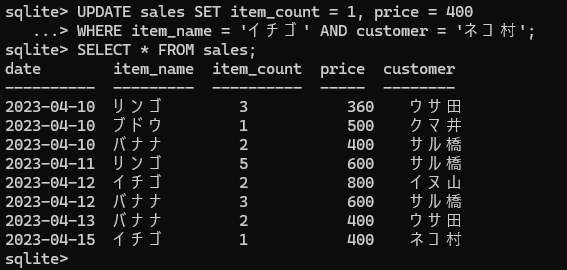

更新対象の条件は、item_nameカラムが「イチゴ」、customerカラムが「ネコ村」、そしてSET句により、対象レコードのitem_countカラムが「1」、priceカラムが「400」に更新される。

**UPDATE文でWHERE句を忘れた場合**

UPDATE文を使う際は、WHERE句で更新するデータの条件を指定する。条件の指定を忘れると、SET句で指定したカラムの値が全て同じになってしまう。

    chap4-11.sql
      UPDATE sales SET date = '2023-04-16';
      SELECT * FROM sales;

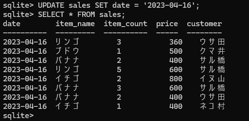

条件を指定していないため、dateカラムのデータが全て「2023-04-16」に更新された。UPDATE文でもWHERE句を使って、更新するデータの条件を指定できる。レストアして変更する前の状態に戻しておく。

    chap4-12.sql
      .restore sample.back

## LESSON20 データを削除しよう

**DELETE文で指定した条件のレコードを削除する**

データを削除するためのSQL文はDELETE文。

    書式：データの削除
      DELETE FROM テーブル名 WHERE 条件式;

SELECT文と同じように、FROM句でデータを削除したいテーブルを指定する。そして、WHERE句で削除したいデータの条件を指定する。

次のDELETE文は、WHERE句でdateカラムが「2023-04-10」のレコードが削除対象。

    chap4-13.sql
      DELETE FROM sales WHERE date = '2023-04-10';
      SELECT * FROM sales;

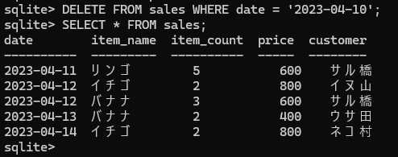

削除したいレコードをしぼりたい場合、WHERE句で複数の条件式を組み合わせる。

**DELETE文ですべてのレコードを削除する**

DELETE文でWHERE句を使わなかった場合、すべてのレコードが削除される。

    chap4-14.sql
      DELETE FROM sales;
      SELECT * FROM sales;

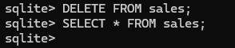

SELECTを実行しても何も表示されないのは、テーブルが空っぽである証拠。WHERE句がないと全て削除されるから、付け忘れないよう注意しなければならない。

**テーブルを削除する**

最後にテーブルを削除するDROP TABLE（ドロップ テーブル）文。次のようにDROP TABLEに続けて、削除したいテーブル名を指定する。

    書式：指定したテーブルを削除する
      DROP TABLE テーブル名;

次のDROP TABLE文を実行するとsalesテーブルが削除される。実行したあと.tablesコマンドでテーブルの一覧を表示させる。

    chap4-15.sql
      DROP TABLE sales;
      .tables

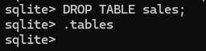

.tablesコマンドを実行しても何も表示されないということは、テーブルが1つもないことになる。

DROP TABLE文もデータを削除する機能の1つで、テーブルを削除することができる。レストアして変更する前の状態に戻しておく。

    chap4-16.sql
      .restore sample.back
