# 第5章「複数のテーブルでデータを管理しよう」

## LESSON21 新しいテーブルを考えよう

**テーブル名とカラム名の命名規則**

テーブルの名前や見出しは、「RDBMSの種類によっては日本語の名前も付けられるが、どんなRDBMSでも使えるSQL文を作れるように英語の名前を付けたほうがよい」ということだったが、その名前を付けるルールは命名規則と呼ばれ、英語の名前を付ける以外にもいくつかルールがある。

● 半角のアルファベット、数字、_（アンダースコア）を使う

a～zとA～Zのアルファベット、0～9の数字、「_（アンダースコア）」を組み合わせて、テーブル名やカラム名を付ける。全角のひらがなや漢字なども使えるが、RDBMSによっては使用できないため避けた方がよい。

また、読みやすくするため、日本語のローマ字表記ではなく、英単語を使用するようにする。

    良い例
      name、item_id、type1

    悪い例
      名前、種類1、namae

● 小文字のアルファベット、大文字のアルファベットのどちら

すべて小文字、もしくはすべて大文字のアルファベットで統一する。

    良い例
      customer、item_id

    悪い例
      Customer、ItemID

● 名前はアルファベットではじめ、単語は「_」で区切る

SQLiteでは、数字からはじめる名前を付けられず、必ずアルファベットからはじまる名前を付ける必要がある。また、複数の単語を組み合わせた名前を付けたい場合は、単語を「_」で区切る。

    良い例
      item_name、item_id

    悪い例
      itemname、1name

● テーブル名の重複や、テーブル内でのカラム名重複はNG

同じ名前のテーブルは作れないため、個々に違う名前を付ける必要がある。また同一テーブル内で、カラム名の重複も禁止。異なるテーブル間であれば、同じカラム名があっても問題ない。

● キーワードとの重複を避ける

キーワード（keywords）とはあらかじめSQLiteで用途が決まっている単語。これまでのSQL文で使用したSELECT、INSERT、UPDATEなどがキーワードに該当する。

**テーブルの構造を決める**

売上情報はsalesテーブル、商品情報はitemテーブルとする。売上情報にある代金は売上情報の個数と、商品情報の価格をかけたもの。商品は識別するためのIDを付けてデータを管理する。

salesテーブル
| date | item_id | item_count | customer |
|----------|-----------|-----------|-----------|
| 2023-04-10 | 6 | 3 | ウサ田 |
| 2023-04-10 | 4 | 1 | クマ井 |
| 2023-04-10 | 7 | 2 | サル橋 |
| 2023-04-11 | 6 | 5 | サル橋 |
| 2023-04-12 | 8 | 2 | イヌ山 |
| 2023-04-12 | 7 | 3 | サル橋 |
| 2023-04-13 | 7 | 2 | ウサ田 |
| 2023-04-14 | 8 | 2 | ネコ村 |

itemテーブル
| item_id | item_name | price | farm | date |
|--------|----------|----------|------------|-----------|
| 1 | ブドウ | 480 | 長野 | 2023-04-01 |
| 2 | イチゴ | 460 | 熊本 | 2023-04-01 |
| 3 | リンゴ | 140 | 長野 | 2023-04-03 |
| 4 | ブドウ | 500 | 山梨 | 2023-04-03 |
| 5 | イチゴ | 500 | 福岡 | 2023-04-05 |
| 6 | リンゴ | 120 | 青森 | 2023-04-09 |
| 7 | バナナ | 200 | 沖縄 | 2023-04-09 |
| 8 | イチゴ | 400 | 栃木 | 2023-04-09 |

## LESSON22 既存のテーブル名を変更しよう

**既存のテーブル名を変更する**

新しいsalesテーブルを作るために、今までのsalesテーブルは「old_sales」という名前に変更する。テーブルの名前はALTER文で変更する。

    書式：テーブル名を変更する
      ALTER TABLE テーブル名 RENAME TO 新しいテーブル名;

ALTERは「変更する」、RENAMEは「名前を変える」という意味がある。TABLEのあとに名前を変更したいテーブル名、TOのあとに新しいテーブル名を指定する。

次のSQL文を実行すると、salesテーブルの名前が「old_sales」に変わる。変更したあと、SELECT文でold_salesテーブルのデータを取り出せるか確認する。

    chap5-1.sql
      ALTER TABLE sales RENAME TO old_sales;
      SELECT * FROM old_sales;

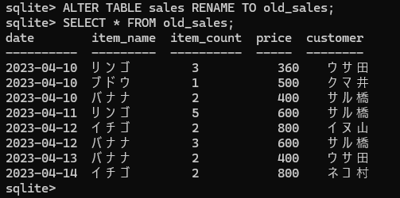

テーブル自体は消さずに、別の名前にしておけば、すぐに前のsalesテーブルを確認できる。

## LESSON23 テーブルを作ってデータを入れよう

**CREATE文について学ぶ**

データベースにテーブルを作るためにはCREATE文を使う。テーブル名のあとには（）に、カラム名を「,（カンマ）」で区切って書く。またカラムには、データ型と制約を指定する。

    書式：テーブルの作成
      CREATE TABLE テーブル名 (
      カラム名1 データ型 制約,
      カラム名2 データ型 制約,
      ...
      );

「chap1_sales.sql」に記述されているCREATE文

    CREATE TABLE sales (
    date TEXT,
    item_name TEXT,
    item_count INTEGER,
    price INTEGER,
    customer TEXT
    );

date、item_name、item_count、price、customerがカラム名

TEXT、INTEGERがデータ型

このSQL文は制約の部分に何も書かれておらず、カラムに制約を指定しない場合は、カラム名とデータ型の組み合わせだけを指定したSQL文になる。データベースの操作ミスを防ぐためには、カラムに入れるデータの種類や、どんな制約を付けるかを考えなければならない。

**データの種類**

データベースで扱うデータには、「数値」「文字列」などの種類があり、このデータの種類のことをデータ型と呼ぶ。

データ型
| 型 | 意味 |
|---------|------------|
| NULL | 何もデータが入っていないことを表すNULL値のこと |
| TEXT | 文字列 |
| INTEGER | 整数 |
| REAL | 浮動小数点数 |
| BLOB | Binary Large OBjectの略で、バイナリデータのこと |

売れた商品の個数や価格は、数値だからINTEGER型。商品名やお客さんの名前は、文字列だからTEXT型。日付は数字が入ってはいるが、記号の「-」が入っているから文字列であるTEXT型。

REAL型は、0.1や0.321のように小数点以下の数値があるデータで、BLOB型は画像や音声データなどのバイナリデータと呼ばれる特殊な形式のデータである。どちらも新しいテーブルでは使わない型。

>**RDBMSごとにデータ型が異なる**
>
>ここで紹介したデータ型は、SQLiteで使えるデータ型。データ型はRDBMSによって異なるため、他のRDBMSを利用する場合は、そのRDBMSで使える型を指定する。例えば、MySQLであれば日付を入れるためのDATE型が用意されている。

**制約の種類**

制約はデータベースのテーブルに対して、設定するルールのようなもので、データの整合性や一貫性を維持するために使用する。制約を設定すると、不正なデータの追加や更新を防げる。

● 主キー制約

主キー制約は、テーブル内の各レコードを一意に識別するためのルールで、主キーに設定されたカラムは値の重複とNULL値が禁止される主キー規約が設定されたカラムは主キーと呼ばれる。

主キー制約を設定する場合、次のように「PRIMARY KEY」をデータ型のあとに書く。

    書式：主キー制約の設定
      カラム名 データ型 PRIMARY KEY

新しく作るitemテーブルのitem_idカラムのデータは、どの商品かを判別するために使いたいから、値が重複しないようにする。

itemテーブル
| item_id | item_name | price | farm | date |
|---------|-----------|-----------|------------|----------|
| 1 | ブドウ | 480 | 長野 | 2023-04-01 |
| 2 | イチゴ | 460 | 熊本 | 2023-04-01 |
| 3 | リンゴ | 140 | 長野 | 2023-04-03 |
| 4 | ブドウ | 500 | 山梨 | 2023-04-03 |
| 5 | イチゴ | 500 | 福岡 | 2023-04-05 |
| 6 | リンゴ | 120 | 青森 | 2023-04-09 |
| 7 | バナナ | 200 | 沖縄 | 2023-04-09 |
| 8 | イチゴ | 400 | 栃木 | 2023-04-09 |

※item_idカラムが主キー

    INSERT INTO item VALUES (7,スイカ,600,'2023-04-10')

item_idカラムの値に7がすでに入っているため、このデータを入れることはできない。

item_idカラムに主キー制約を設定すると、値の重複が禁止されて、同じ値を入れられなくなる。つまり、item_idカラムの値が重複しなかったら、item_idカラムのデータだけで、商品や価格が探せることになる。

● NOT NULL制約

NOT NULL制約が設定されたカラムは、NULL値の使用が禁止されている。そのため、必ずデータが入っていることが保証される。

NOT NULL制約を設定する場合、次のように「NOT NULL」をデータ型のあとに書く。

    書式：NOT NULL制約の設定
      カラム名 データ型 NOT NULL

NOT NULL制約を設定すると、データの追加漏れが防げる。

    INSERT INTO item SET (item_id,item_name,farm)
    VALUES (9,スイカ,'沖縄','2023-04-10')

カラム名にprice、dateがなく、priceの値もないため、このデータを入れることはできない。

**テーブルの構造を整理する**

SQL文を作る前に、テーブルのカラム名とデータ型、制約を整理しておく。

salesテーブルは全てのカラムに対して、NOT NULL制約を設定する。

salesテーブル
| 主キー | カラム名 | データ型 | NULL許可 |
|--------|----------|----------|---------|
|  | date | TEXT | × |
|  | item_id | INTEGER | × |
|  | item_count | INTEGER | × |
|  | customer | TEXT | × |

itemテーブルは、item_idの値が重複せずまたNULLにならないように、主キー制約を付ける。また、それ以外のカラムはNOT NULL制約を付ける。

itemテーブル
| 主キー | カラム名 | データ型 | NULL許可 |
|-------|--------|--------|--------|
| ○ | item_id | INTEGER | × |
|  | item_name | TEXT | × |
|  | price | INTEGER | × |
|  | farm | TEXT | × |
|  | date | TEXT | × |

テーブルのカラムやデータ型、制約が一目で分かるため、テーブルを作るときは、情報を整理しておくことがおすすめ。

**新しいテーブルを作る**

salesテーブルを作るSQL文

    chap5-2.sql
      CREATE TABLE sales (
      date TEXT NOT NULL,
      item_id INTEGER NOT NULL,
      item_count INTEGER NOT NULL,
      customer TEXT NOT NULL
      );

itemテーブル

    chap5-3.sql
      CREATE TABLE item (
      item_id INTEGER PRIMARY KEY,
      item_name TEXT NOT NULL,
      price INTEGER NOT NULL,
      farm TEXT NOT NULL,
      date TEXT NOT NULL
      );

実行しても何も表示されない場合、テーブルの作成に成功しているはず。.tebleコマンドで、テーブルができているか確認する。

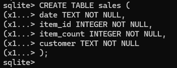　　　　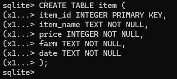

    【入力コマンド】テーブルの一覧を表示する
      .tables

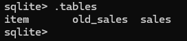

テーブル名が表示されれば作られている。

**新しいテーブルにデータを作成する**

INSERT文でsalesテーブルとitemテーブルにデータを入れる。

salesテーブル

    chap5-4.sql
      INSERT INTO sales VALUES ('2023-04-10', 6, 3, 'ウサ田');
      INSERT INTO sales VALUES ('2023-04-10', 4, 1, 'クマ井');
      INSERT INTO sales VALUES ('2023-04-10', 7, 2, 'サル橋');
      INSERT INTO sales VALUES ('2023-04-11', 6, 5, 'サル橋');
      INSERT INTO sales VALUES ('2023-04-12', 8, 2, 'イヌ山');
      INSERT INTO sales VALUES ('2023-04-12', 7, 3, 'サル橋');
      INSERT INTO sales VALUES ('2023-04-13', 7, 2, 'ウサ田');
      INSERT INTO sales VALUES ('2023-04-14', 8, 2, 'ネコ村');

itemテーブル

    chap5-5.sql
      INSERT INTO item VALUES (1, 'ブドウ', 480, '長野', '2023-04-01');
      INSERT INTO item VALUES (2, 'イチゴ', 460, '熊本', '2023-04-01');
      INSERT INTO item VALUES (3, 'リンゴ', 140, '長野', '2023-04-03');
      INSERT INTO item VALUES (4, 'ブドウ', 500, '山梨', '2023-04-03');
      INSERT INTO item VALUES (5, 'イチゴ', 500, '福岡', '2023-04-05');
      INSERT INTO item VALUES (6, 'リンゴ', 120, '青森', '2023-04-09');
      INSERT INTO item VALUES (7, 'バナナ', 200, '沖縄', '2023-04-09');
      INSERT INTO item VALUES (8, 'イチゴ', 400, '栃木', '2023-04-09');

データが入ったか確認

    chap5-6.sql
      SELECT * FROM sales;

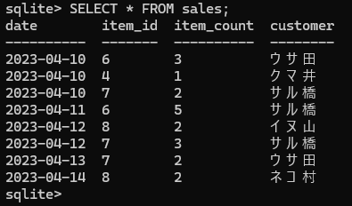

    chap5-7.sql
      SELECT * FROM item;

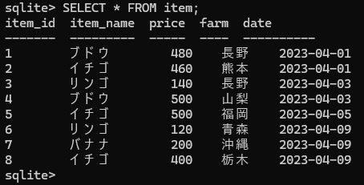

**テーブルに設定した制約が有効かを確認する**

salesテーブルの全てのカラムにはNOT NULL制約、itemテーブルはitem_idカラムに主キー制約、それ以外のカラムはNOT NULL制約を設定した。これらの制約が有効なのかを確認する。

まずはsalesテーブルで、次のSQL文はVALUESのあとのカッコにデータが3つしかないため、実行に成功してしまうと4つ目のcustomerカラムにNULLが入ってしまう。

    chap5-8.sql
      INSERT INTO sales (date, item_id, item_count)
      VALUES ('2023-04-15', 2, 3);

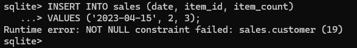

Runtimeエラーは、実行に失敗したことを表している。そのあとの原因を表すメッセージは「NOT NULL制約が失敗しました：sales.customer」という意味で、customerカラムがNULLになってしまうからエラーになった。つまり、NOT NULL制約が有効な証拠となる。

次のSQL文はitemテーブルに対し、データの追加を行うSQL文。

    chap5-9.sql
      INSERT INTO item VALUES (7, 'スイカ', 600, '千葉', '2023-04-10');

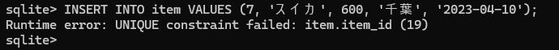

このRuntimeエラーも、実行に失敗したことを表している。その次は「UNIQUE（ユニーク）制約が失敗した：item_id」という意味で、ユニークは一意という意味があって、値が重複していることがエラーの原因。item_idが「7」のレコードはすでにあるから、実行に失敗したということになり、主キー制約も有効であることが確認できる。

## LESSON24 テーブルを結合してデータを取り出そう

**テーブルの結合**

テーブルの結合とは、複数のテーブルを指定したカラムで関連付けて、テーブルを合体させること。

この機能を使うことで、別々のテーブルであるsalesテーブルとitemテーブルを結合し、1つのテーブルとしてデータを取り出すことができる。

**INNER JOIN句でテーブルを結合する**

内部結合はINNER JOIN句を使う。INNER JOINはそのまま「内部結合」という意味。

    書式：テーブルの内部結合の基本
      SELECT カラム名 FROM テーブル名1
      INNER JOIN テーブル名2 ON テーブル名1.カラム名 = テーブル名2.カラム名;

INNER JOIN句はFROM句のあとに続けて、統合させたいもう片方のテーブルを指定し、さらにONのあとに関連付けたいカラム名を書く。2つのテーブルに同じ名前のカラムがある場合は、テーブル名とカラム名を「.」でつなげて書く。

    chap5-10.sql
      SELECT * FROM sales
      INNER JOIN item ON sales.item_id = item. item_id;

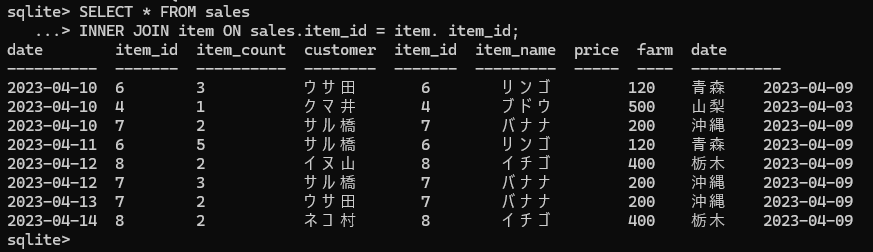

INNER JOIN句でテーブルを結合させるときに大切なのが、どのカラムを関連付けるかということ。salesテーブルとitemテーブルは、同じ意味を持つitem_idカラムがあるから、関連付けるカラムとして指定している。

1行目の「sales」、2行目のはじめの「item」が結合するテーブル、「sales.item_id」と「item.item_id」が関連付けるカラムになる。同じ意味を持つカラムを指定しないと、テーブルが結合されず、何も出力されなくなってしまうから注意が必要。

結合したテーブルに対してもデータを取り出すカラムを個別に指定できる。結合する2つのテーブルに同じ名前のカラムがある場合は、「テーブル名.カラム名」の形で指定する。どちらか片方にしかないカラムの場合は、テーブル名を省略できる。

    chap5-11.sql
      SELECT sales.date, sales.item_id, item_name, item_count, customer
      FROM sales INNER JOIN item ON sales.item_id = item.item_id;

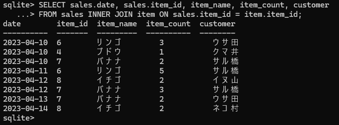

SELECT句で「*」を指定してしまうと、結合したテーブルの全カラムのデータが取り出されてしまうから、必要なカラムだけを指定する。

**INNER JOIN句とWHERE句を組み合わせる**

INNER JOIN句で結合したテーブルに対して、WHERE句で取り出すデータの条件を指定できる。ON句のあとに続けてWHERE句を書く。

    書式：テーブルを結合し、条件を指定してデータを取り出す
      SELECT カラム名1, カラム名2, ... FROM テーブル名1
      INNER JOIN テーブル名2 ON テーブル名1.カラム名 = テーブル名2.カラム名
      WHERE 条件式;

次のSQL文を実行すると、salesテーブルとitemテーブルを結合したテーブルから、item_nameカラムの値が「リンゴ」のデータを取り出す。

    chap5-12.sql
      SELECT sales.date, sales.item_id, item_name, item_count, customer
      FROM sales INNER JOIN item ON sales.item_id = item.item_id
      WHERE item_name = 'リンゴ';

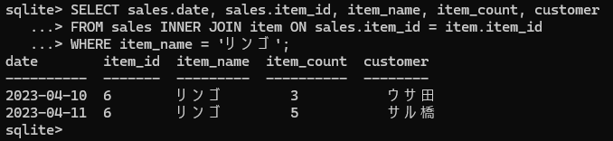

INNER JOIN句とWHERE句を組み合わせるとき、条件は結合したテーブルに対して付けられる。

「FROM句」データを取り出すテーブルを指定する→「INNER JOIN句　ON句」テーブルを結合する→「WHERE句」取り出すデータの条件を付ける→「SELECT句」取り出すカラムを指定する

INNER JOIN句は他にもGROUP BY句、HAVING句、ORDER BY句とも組み合わせられる。

**INNER JOIN句とGROUP BY句を組み合わせる**

INNER JOIN句とGROUP BY句を組み合わせたときと同様に、結合したテーブルに対してグループ化を行う。結合したテーブルをsales.item_idカラムでグループ化し、SUM関数の引数にitem_countを指定する。

    chap5-13.sql
      SELECT sales.item_id, item_name, SUM(item_count)
      FROM sales INNER JOIN item ON sales.item_id = item.item_id
      GROUP BY sales.item_id;

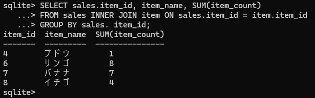

結合したテーブルでもグループ化できるから、集計関数を使って売れた個数も一目で分かる。

## LESSON25 テーブルのデータで計算をしよう

**算術演算子を使ってみる**

コンピュータ上で行う数値の計算は、算術演算という。そして算術演算に使用する記号が算術演算子。足し算は、紙の上で行う計算と同じく「+」を使う。

次のSQL文は5足す5の計算を行う。SELECT文でテーブルを使用しない場合は、FROM句は付けない。

    chap5-14.sql
      SELECT 5 + 5;

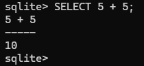

算術演算子
| 演算子 | 意味 |
|------|-------|
| + | 足し算 |
| - | 引き算 |
| * | 掛け算 |
| / | 割り算 |
| % | 割り算の余りを求める |

複数の算術演算を行うときは「,」で区切る。

    chap5-15.sql
      SELECT 5 + 2, 5 - 2, 5 * 2, 5 / 2, 5 % 2;

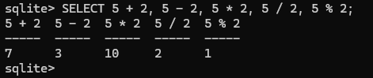

%演算子は割り算の余りを求める演算子だから、5割る2で答えは2と余り1になるから、余りである1が出力される。

**カラムの値を使って計算する**

代金を求めるためには、salesテーブルのitem_countカラムの値とitemテーブルのpriceカラムの値で掛け算を行う。

    chap5-16.sql
      SELECT sales.date, sales.item_id, item_name, item_count * price
      FROM sales INNER JOIN item ON sales.item_id = item.item_id;

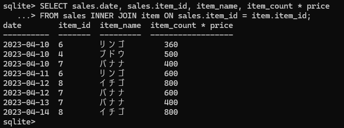

item_countとpriceを掛けた金額で表示された。

算術演算子を使った式に対してもASキーワードを使える。

    chap5-17.sql
      SELECT sales.date, sales.item_id, item_name,
      item_count * price AS total_price
      FROM sales INNER JOIN item ON sales.item_id = item.item_id;

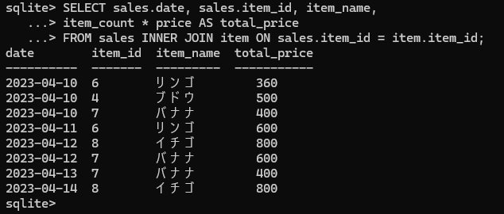

**集計関数の引数に演算結果を渡してみる**

関数の引数には算術演算子を使った式を渡すことも可能。

    書式：関数の引数に式を渡す
      関数名(カラム名1 算術演算子 カラム名2)

次のSQL文ではSUM関数の引数に「item_count * price」の式を渡している。

    chap5-18.sql
      SELECT SUM(item_count * price)
      FROM sales INNER JOIN item ON sales.item_id = item.item_id;

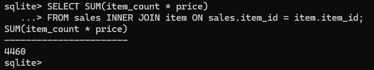

結合したテーブルの「item_count * price」の計算結果をSUM関数で合計し、全商品の合計金額が表示された。

    書式：関数の結果を使って計算する
      関数名(カラム名1) 算術演算子 カラム名2

次のSQL文では、SUM関数に引数でitem_countを渡し、得られた結果をpriceカラムの値と掛け算する。

    chap5-19.sql
      SELECT sales.item_id, item_name, SUM(item_count) * price
      FROM sales INNER JOIN item
      ON sales.item_id = item.item_id
      GROUP BY sales.item_id
      ORDER BY SUM(item_count) * price DESC;

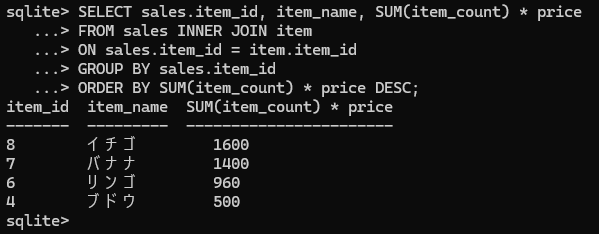

item_idカラムの値でグループ化して、「SUM(item_count) * price」でグループごとの代金を求めている。さらに、代金で降順に並べ替えている。

>**算術関数**
>
>集計関数以外にも算術関数や、日付関数といった種類の関数がある。算術関数の中でよく使用されるROUND関数は、引数の数値を四捨五入する。1つ目の引数で四捨五入したい数値、2つ目の引数で表示したい小数点以下の桁数を指定する。例えば、次のSQL文を実行すると、5.678という数値が四捨五入され、5.68と出力される。
>
>     chap5-20.sql
>      SELECT ROUND(5.678,2);
>
>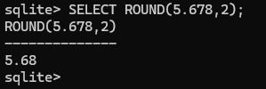

## LESSON26 データをCSVファイルに書き出そう

最後に、取り出したデータをテキストファイルに出力して、表計算ソフトのExcelで表形式に表示させる。

**CSVファイルを書き出す**

Excelで表形式で表示させるために、まずは実行結果の表示モードをcsv形式に変更する。csv形式にすることで、取り出したデータが「,」区切りで表示される。

    書式：csv形式の表示に変更する
      .mode csv

ファイルの書き出しには.onceコマンドを使う。.onceコマンドの直後に実行したSQL文の結果をテキストデータとして出力できる。

    書式：次に実行するSQL文の結果をファイルに出力する
      .once ファイル名

.modeコマンド、.onceコマンドを実行したあと、SELECT文を実行する。出力するファイル名は「export_sample.csv」とする。

    chap5-21.sql
      .mode csv
      .once export_sample.csv
      SELECT sales.date, sales.item_id, item_name, item_count, customer
      FROM sales INNER JOIN item ON sales.item_id = item.item_id;

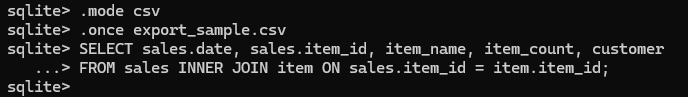

.onceコマンドを実行したあとのSELECT文は、実行結果がテキストデータとして出力される。

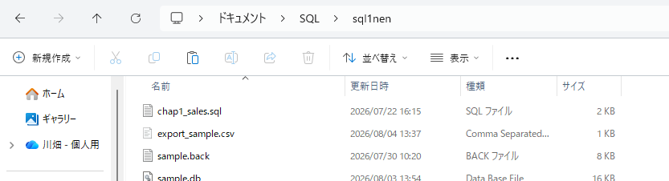

「sql1nen」フォルダにexport_sample.csvが作成され、Excelで開く前に、メモ帳などのテキストエディタで中身を確認する。①ファイル名を右クリックし、②[プログラムから開く]③[メモ帳]をクリックする。

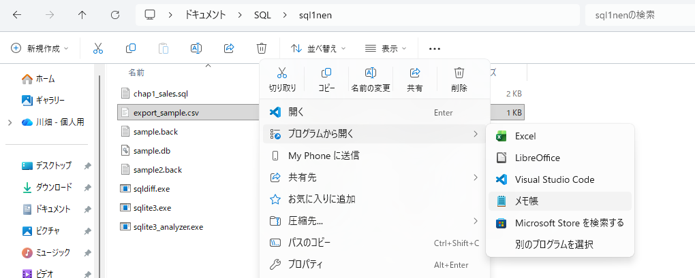　　　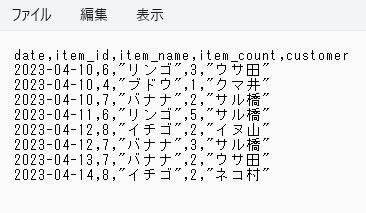

csv形式で出力すると、値は「,」区切りで、文字列は「"」で囲まれる。

**Windowsで出力したCSVファイルをExcelで読み込む**

① Excelを開き読み込むファイルの形式を選択する

Excelを開いて新規の空白のブックを選択し、①[データ]をクリック、続けて②[テキストまたはCSVから]をクリックする。

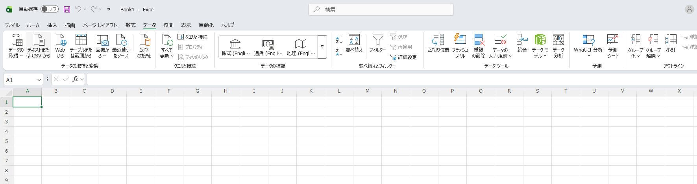

② 読み込むファイルを選択する

①export_sample.csvをクリックして選択し、②[インポート]をクリックする。

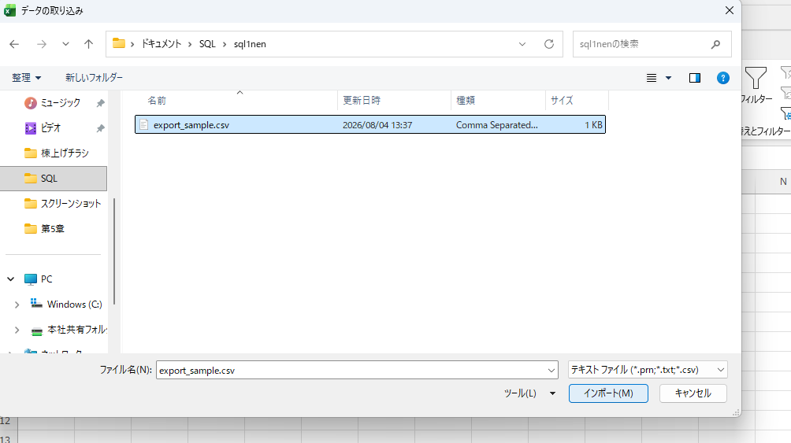

③ 読み込む形式を確認する

区切り記号が[コンマ]になっていること、プレビューが表形式になっていることを確認して、①[読み込む]をクリックする。

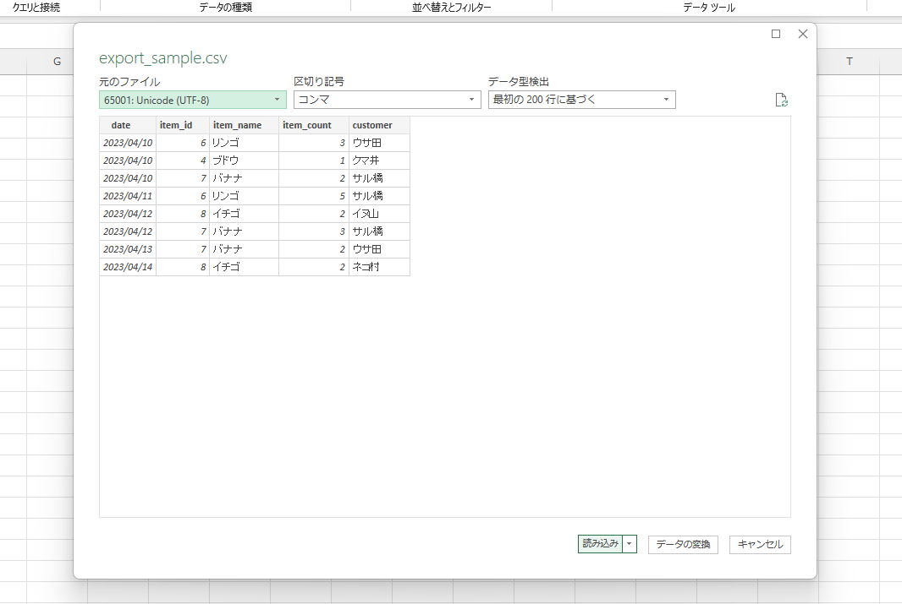

④ 読み込み完了

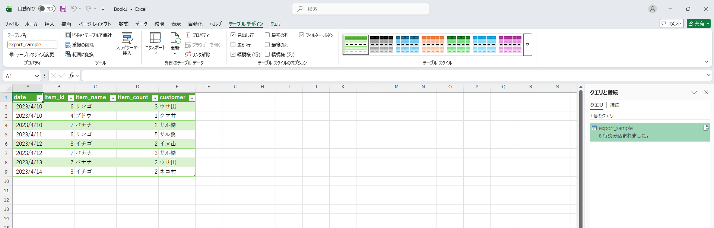

## LESSON27 これから何を勉強したらいいの？

今回はシンプルなデータベースだったが、3つ以上のテーブルの結合や、SQL文の中にSQL文を入れた複雑なSQL文を作ることもできる。サブクエリといって、取り出したデータを対象に、さらにSELECT文でデータを取り出す操作がある。